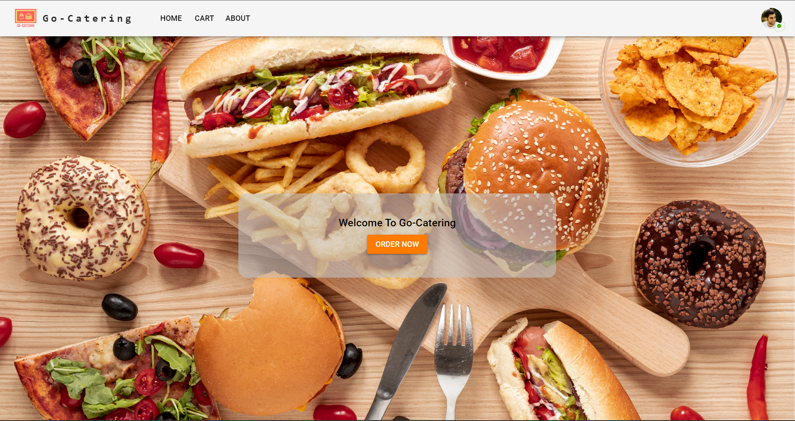
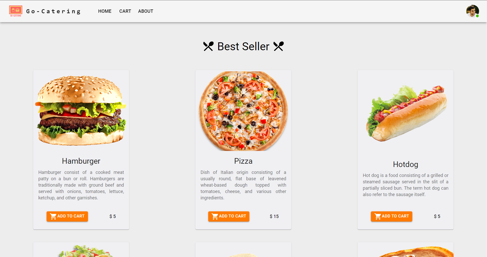
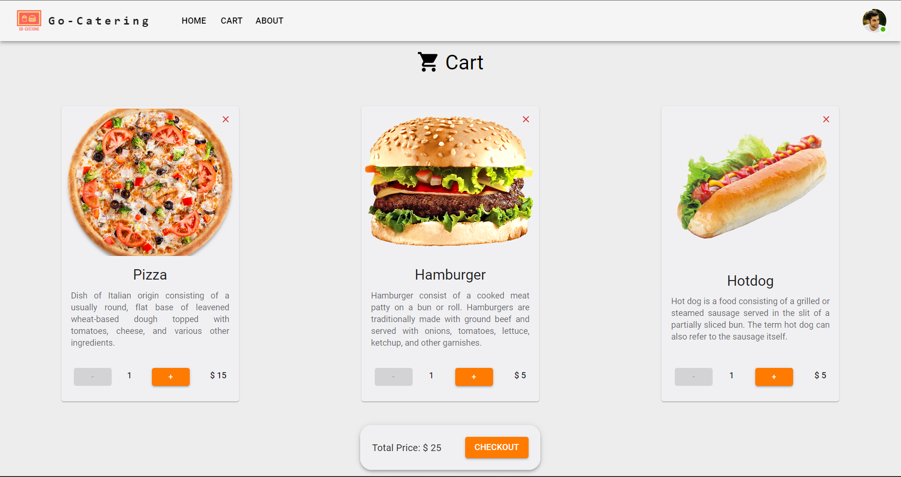
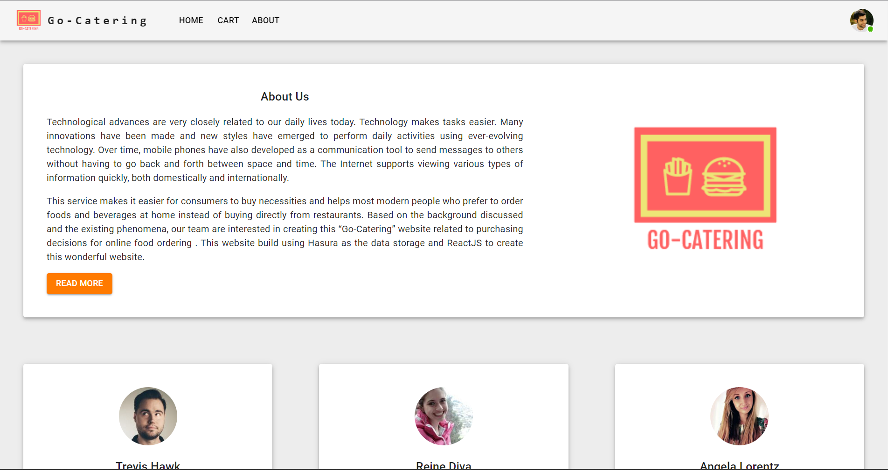

# Go-Catering

Go-Catering is a food ordering website that used Hasura as the GraphQL Engine and ReactJS as the JavaScript library to build the Front-End.

Features:

- User is able to add food to the cart
- User is able to delete food from the cart
- User is able to update food from the cart
- User is able to checkout the food from the cart

Pages:

Welcome Page
  

Home Page
  

Cart Page
  

About Page
  

